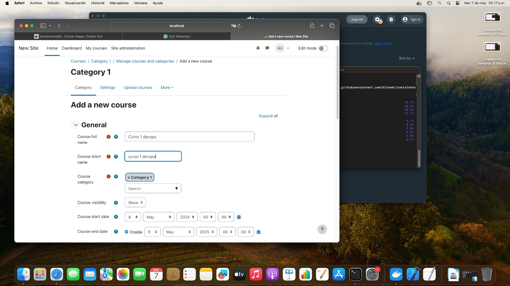
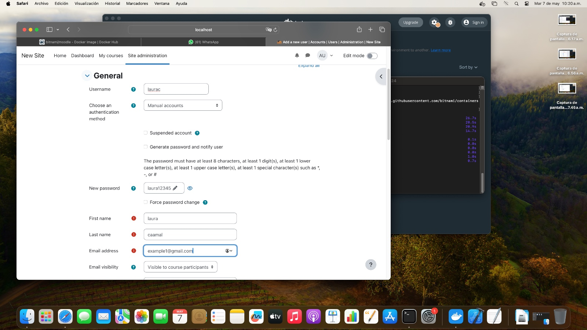
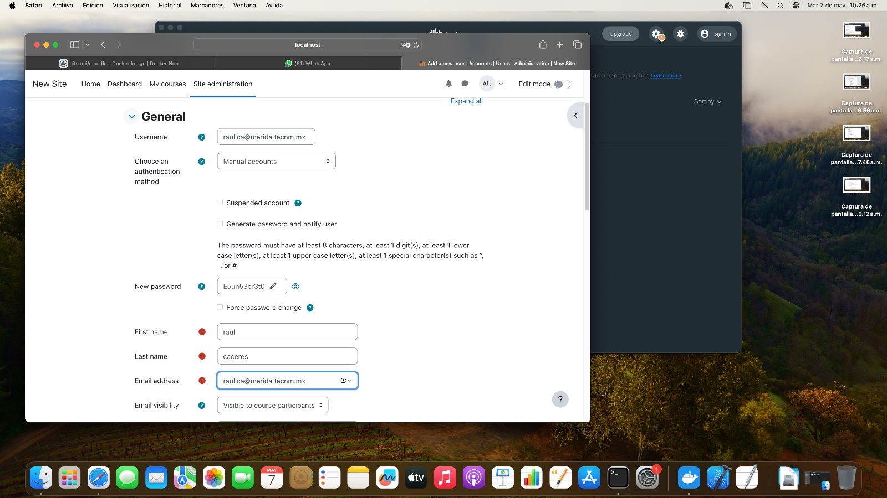
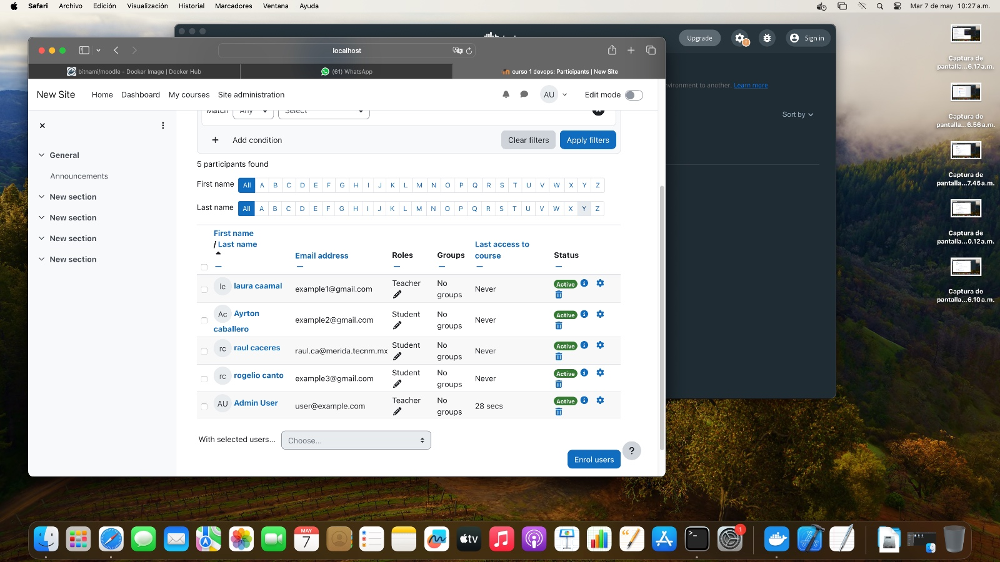
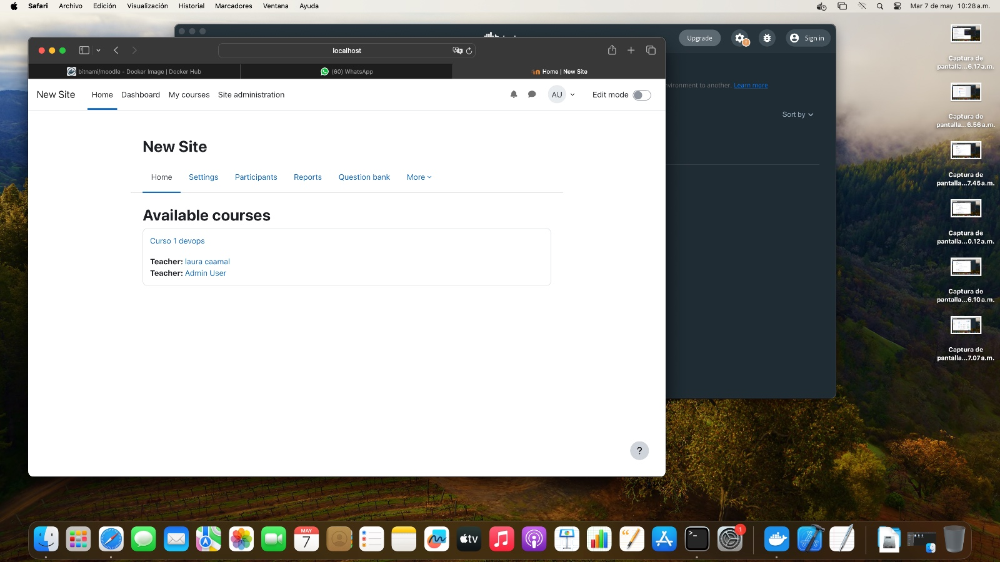

# MoodlePersonal
Bajar de github a local git clone https://github.com/logangremor/MoodlePersonal.git

cd MoodlePersonal/

Levantar con docker docker-compose up -d

Verificar IP ip a

Configurar moodle
Ingresamos y hacemos login

Creamos un nuevo curso

Agregamos los datos requeridos del curso

Y nuestro primer curso en moodle queda concluido

# Cuestionario Mac OS

¿Qué modelo de Mac? 
Mac Pro 2019

¿Cuánta memoria RAM tiene? 
96 GB DDR4 a 2666Mhz

¿Qué procesador tiene? 
Intel Xeon W

¿Cuántos núcleos tiene? 
8 nucleos

¿Cuántos hilos de ejecución tiene? 
16 Hilos

# Practica en MAC

primero creamos una carpeta con el nombre eq2 
de ahi fuimos a la pagina de docker compose moodle para descargar la bade de datos 
  
  
luego comprobamos que este funcionando y entramos a localhost 
y posteriormente nos logueamos 
usuario: user 
contraseña: bitnami 
 
luego de loguearnos creamos el curso, que seria curso 1 devops
 
posteriormente creamos los usuario, laura, ayrton, rogelio y raul caceres 
con raul caceres usamos el siguiente usuario y contraseña 
usuario: raul.ca@merida.tecnm.mx 
contraseña: “E5un53cr3t0! 
 
 
 
checamos que esten todos como alumnos y seleccionamos a un integrante como maestro 
en este caso fue laura 
checamos que efectivamente laura esta como maestro en el curso 1

